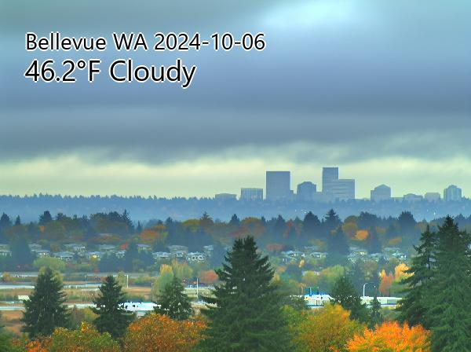
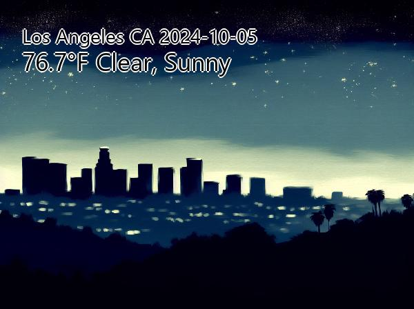

# E-Ink Picture Frame Project

A project to generate images based on the current weather for given locations, specifically for use in e-ink displays.

## Setup
`pip install -r requirements.txt`

### API Keys
Set environment variable `OPENAI_API_KEY`. You will need an OpenAI api key: https://platform.openai.com/docs/api-reference/authentication

Set environment variable `TOMORROW_API_KEY`. You will need a Tomorrow api key: https://docs.tomorrow.io/reference/intro/getting-started

## Run

`python genimage.py`

This outputs a couple images:
* sample-out.jpg
    * This is the jpg approximation of what will be quantized for the e-ink display
* weather_image.jpg
    * This is the output from DALL-E
* quantized.bmp
    * This is the image formatted for the e-ink display

Weather data is cached in `forecast_data.json` and `realtime_data.json`.

## Display

This code will generate images in a few different formats for general use, as well as formatted specifically for an E-Ink display.

### E-Ink

This project generates images for use in Waveshare E-Ink displays. Specifically the 5.65 7-Color display: https://www.waveshare.com/5.65inch-e-paper-module-f.htm

## Example output

